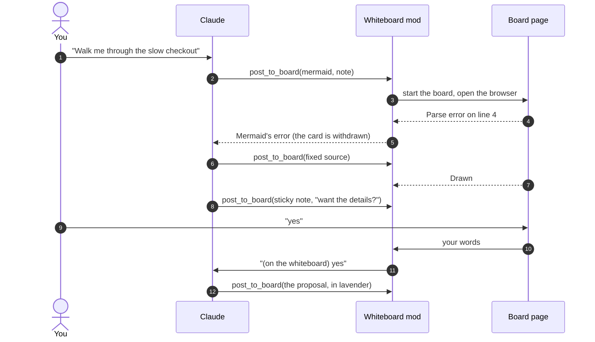

# Whiteboard

**A whiteboard beside your Claude Code session: Claude draws as it explains, you answer on the board, and you can edit a diagram together.**

- **Diagrams as Claude explains.** Real [Mermaid](https://mermaid.js.org), every
  diagram type, on a page in your browser. One tab per diagram, with zoom, pan,
  a legend and sticky notes.
- **A two-way board.** Type on the page and your words go into the same Claude
  Code session. Claude answers on the board, with another drawing when one
  helps.
- **Edit together.** Switch a diagram to a canvas: drag, write and connect
  boxes. Claude reads what you changed and what you selected, and amends the
  diagram in place.
- **Nothing to set up.** Node.js 18 and the plugin. The board runs on
  127.0.0.1, downloads nothing, and ends with the session.


<sub>A recording of a real Claude Code session, sped up while Claude works. The project is simulated (`demo/checkout-service/`); Claude, the plugin and every diagram are real, and the replies on the board were typed by a script standing in for the user.</sub>

Works in any terminal, and in the Code tab of the Claude desktop app. It draws
for questions about your project ("how does checkout work?") and for general
ones ("how does OAuth work?").

> **Open source project, not affiliated with or endorsed by Anthropic.** Claude and
> Claude Code are trademarks of Anthropic, PBC.
>
> **For Claude Code,** in a terminal or in the Code tab of the Claude desktop
> app. It does not work in the desktop app's **Claude** (chat) or **Cowork**
> modes, on claude.ai, or with `claude -p`.
>
> **Experimental.** Built on Claude Code's mods, which are new and may change
> between releases. Tested in macOS Terminal with Claude Code 2.1.290.

## Try it: three prompts to paste

```
How does OAuth work? Show me on the whiteboard.
```

```
Walk me through how a request travels through this project, on the
whiteboard: the big picture first, then one level down each time I ask.
```

```
Checkout is slow since the last release. Investigate it on the whiteboard:
draw the request path with every step grey, redraw it as you find evidence,
and pin any fix as a sticky note before you draw it in.
```

Then answer in the box on the page. Your reply goes into the session, and
Claude answers on the board.

## A question, drawn

The same question, "How does OAuth work?", asked twice in Claude Code. First
the answer streams by in the terminal. Then, with the plugin, Claude draws the
flow as a sequence diagram in your browser and pins the gotchas (PKCE, the
`state` parameter) beside it as sticky notes. A follow-up typed on the board
arrives in the terminal session and gets a diagram of its own.


<sub>Both halves are real Claude Code sessions. The first is snapshots of the Terminal window as the answer streamed in; the second is a recording of the board, with snapshots of the same session's Terminal, and the follow-up typed by a script standing in for the user.</sub>

## What the board does

Claude puts a picture on the board whenever a picture says it better, and
redraws as the conversation moves: the hypothesis first, then what the
evidence shows, then a proposed fix.

- **One tab per diagram.** Each diagram is a tab across the top; the newest
  opens as it arrives. A redraw of the same flowchart keeps its zoom and place,
  so stepping between the tabs shows only what changed.
- **Zoom, pan, source.** Pinch or Ctrl+scroll to zoom, drag or use the arrow
  keys to pan, **Fit** to see it whole, **Code** for the Mermaid source with a
  Copy button.
- **Colours that each answer one question,** with a legend above the diagram:
  grey, not measured yet; green, no problem; red, a problem; lavender, a
  proposed change.
- **Sticky notes.** Claude pins a proposal, a question or a gotcha beside the
  box it is about (in a flowchart; beside the diagram in other types), without
  changing the diagram. It proposes, asks whether you
  want to see the change, and draws it in lavender when you say yes.
- **Mermaid errors go back to Claude.** The page draws each diagram and reports
  how it went. When Mermaid rejects one, Claude gets the error, corrects the
  source and draws again. You only see the result.
- **Your replies go into the session.** Claude's notes appear beside the
  diagrams. What you type there goes into the same Claude Code session, as if
  you had typed it in the terminal, and the session remembers the whole
  discussion. The page shows **Sent** when your message is delivered and
  **Claude is working** while Claude answers. What you ask on the board is
  answered on the board; when you type in the terminal again, Claude answers
  there.
- **Two modes.** **Diagrams**: Claude's diagrams as drawn, each new one a
  tab, for explaining and investigating. **Canvas**: you and Claude edit every
  diagram together, for designing. Switch at the top of the page, with
  `/whiteboard canvas`, or let Claude pick when it opens the board. Switching
  makes the diagram on screen editable, and every new one; earlier diagrams
  stay as they were drawn. **Edit** on a diagram makes just that one
  editable, in either mode.
- **Edit a diagram yourself.** On a canvas, drag boxes, write, add boxes,
  arrows and sticky notes. Your changes go to
  Claude in words with your next message ("moved `cache` below `api`; added a
  box "Redis?""), and Claude amends the diagram in place, keeping your layout,
  instead of drawing it again. Flowcharts, sequence, class, state and ER
  diagrams.
- **Claude can read the board back:** every diagram's source, its sticky notes,
  what you changed on a canvas and your messages, including a sample or a file
  you opened yourself; and a picture of a diagram when words are not enough.
- **Closed the tab?** Claude's next post opens it again, with everything so far.
- **Wrap up.** One button asks Claude to summarise what you concluded in the
  conversation; then the page says so and closes its tab (or, if the browser
  does not let a page close itself, tells you it is done).
- **Narrow windows and touch screens.** Below 900 px wide, the board and the
  conversation become two views, switched at the top, with a count of Claude's
  new messages. Drag to pan, pinch to zoom, double-tap to fit.

## How it works


The mod gives Claude three tools, `post_to_board`, `edit_board` and
`read_board`, and the `/whiteboard` command.
The first post starts a small server for the session (Node's standard library,
nothing installed) and opens its page in your browser. The page draws with the
Mermaid bundled in the plugin, and edits with the bundled Excalidraw, so
nothing is downloaded and no CDN is used.
Each session has its own board, labelled with its folder's name.



## Install

Requirements: Claude Code 2.1.287 or later (mods are on by default from that
version) and Node.js 18 or later, on macOS. The plugin finds Node on your PATH
or where nvm, volta, fnm, asdf or mise put it. Linux should work but is
untested; Windows is not supported yet.

This repository is its own plugin source: Claude Code reads the plugin list in
`.claude-plugin/marketplace.json` and installs `whiteboard` from the `plugin/`
folder, nothing else. Add the repository as a marketplace, then install
`whiteboard` from it:

- **In the Claude desktop app:** open Settings, find the plugins section, add
  the marketplace `mazzucci/whiteboard`, then install **whiteboard** from it.
- **In a terminal:**

  ```bash
  claude plugin marketplace add mazzucci/whiteboard
  ```

  ```bash
  claude plugin install whiteboard@mazzucci
  ```

  `whiteboard@mazzucci` is the plugin `whiteboard` from the marketplace
  `mazzucci`, the name this repository's plugin list goes by.

The desktop app warns that this marketplace is not Anthropic's and that a
plugin runs code on your machine. That is expected for a third-party plugin:
see [Security and privacy](#security-and-privacy) for what this one runs.

Then start a new session. There is no setup step: the first diagram opens the
board.

**To update:** refresh the marketplace first so Claude Code sees the new
version, then update the plugin and start a new session. Desktop app: Settings,
plugins section. Terminal: `claude plugin marketplace update mazzucci`, then
`claude plugin update whiteboard@mazzucci`.

**To uninstall:** `claude plugin uninstall whiteboard@mazzucci`, and
optionally `claude plugin marketplace remove mazzucci`.

**Installed as `whiteboard@whiteboard`?** The marketplace was called
`whiteboard` until version 0.2.2. Your install keeps working and updating
under that name (use `whiteboard` in place of `mazzucci` above). To move to
the new name: `claude plugin marketplace remove whiteboard`, then add
`mazzucci/whiteboard` again and install `whiteboard@mazzucci`.

**Upgrading from 0.1?** Version 0.1 drew in a pane of the desktop app with a
headless Chrome that its `/whiteboard setup` downloaded into
`~/.cache/whiteboard`. Later versions need none of it: delete
`~/.cache/whiteboard` after updating (or run 0.1's `/whiteboard uninstall`
before).

### Ask Claude to install it

In Claude Code, paste:

```
Install the whiteboard plugin from https://github.com/mazzucci/whiteboard,
following the "Instructions for Claude" in its README.
```

### Instructions for Claude

You are installing this plugin for the person you are working with. Follow
these steps in order, and stop to tell them if one fails.

1. **Check the requirements.** Run `node --version`: it must be 18 or later
   (a Node from nvm, volta, fnm, asdf or mise counts). The OS must be macOS or
   Linux. If either check fails, stop and say which.
2. **Tell the person what will happen, and wait for their go-ahead:** Claude
   Code adds this repository as a plugin marketplace and installs the
   `whiteboard` plugin from it. Nothing else is downloaded. When Claude draws,
   the plugin runs a small local server (127.0.0.1 only) and opens a page in
   their browser.
3. **Install with Claude Code's plugin manager.** If `claude` is on the PATH,
   run `claude plugin marketplace add mazzucci/whiteboard`, then
   `claude plugin install whiteboard@mazzucci`. If it is already installed,
   update it instead with `claude plugin marketplace update mazzucci` and
   `claude plugin update whiteboard@mazzucci` (an older install goes by
   `whiteboard@whiteboard`: use `whiteboard` as the marketplace name in both
   commands). If `claude` is not on the
   PATH (often the case for desktop app users), ask the person to add the
   marketplace `mazzucci/whiteboard` in the desktop app's Settings, plugins
   section, and install **whiteboard** from it.
4. **Tell the person the next steps:** start a new Claude Code session (plugins
   load when a session starts), then ask for a walkthrough or a diagram. If
   `/whiteboard` is missing in the new session, the mod did not load: check
   that their Claude Code version supports mods.

Do not clone the repository by hand, and do not change their Claude Code
settings, permissions or other plugins as part of this install.

### Try it from a clone

`claude --plugin-dir /path/to/whiteboard/plugin` loads a local copy for one
session.

## Use

Ask for a walkthrough ("walk me through this investigation", "how does
checkout work?"), a picture ("draw the auth flow"), or an explanation ("how
does TLS work?"). Claude draws when a diagram helps; say "on the whiteboard" to
be sure. The bundled `whiteboard:drawing` skill teaches it to keep diagrams
legible and honest.

To move a discussion to the board, run `/whiteboard focus`: Claude answers on
the board, and you discuss there until you press **Wrap up**.

### Commands

| Command | |
|---|---|
| `/whiteboard` | Open the board (again, if you closed its tab) |
| `/whiteboard focus` | Discuss on the board until you wrap up |
| `/whiteboard canvas` | Open the board in canvas mode: edit the diagrams together |
| `/whiteboard path/to/file.mmd` | Show a Mermaid file (or the first `mermaid` block of a Markdown file) |
| `/whiteboard sample` | Draw a sample |

### Keys on the board

| | |
|---|---|
| Tabs, or `[` / `]` | previous / next diagram |
| `i` / `o`, pinch, Ctrl+scroll | zoom in / out |
| `f`, double-click, double-tap | fit the diagram to the board |
| drag, arrow keys | pan |
| `c` | Mermaid source, with Copy |
| Enter | send your reply (Shift+Enter for a new line) |

## Reading the diagrams

A polished diagram makes a guess look like a fact, so the bundled skill asks
Claude to show the difference: real module, file and service names, the
mechanism on each edge, `file:line` citations in the answer, and colours that
say how much is known. Each colour answers one question, and has its own
border so it reads without colour too:

| | |
|---|---|
| grey, dashed | not checked or measured yet |
| green | checked, no problem |
| red | checked, a problem |
| lavender, dashed | a proposed change, not made or measured yet |

While troubleshooting, Claude starts from a hypothesis with every step grey,
and redraws the same diagram as evidence comes in, so the tabs read as the
investigation. A fix starts as a sticky note on the box it changes; when you
want it, Claude redraws the diagram with the change in lavender.

The same recipe colours a diagram by any **lens**: risk across a change, test
coverage, the progress of a CI pipeline or a migration, or one you invent ("by
owner", "by latency"). These are conventions in the skill, not features of the
board: any Mermaid works.

## Security and privacy

The board is a small web server on your machine, and what is typed on its page
goes into your Claude Code session as your own words. So:

- **The board's link is a key.** The address the plugin opens carries a random
  token. Whoever has it, a person or a program on your machine, can send
  messages into your session as you, and Claude acts on them with the
  permissions you have given it (in auto mode, without asking). Don't share the
  link. Once the page has loaded, the token leaves the address bar and the page
  keeps it in that tab; the address first opened may stay in your browser's
  history, which is harmless once the session has ended.
- **Local only.** The server listens on 127.0.0.1, on a random port. It answers
  only its own host name (so a website cannot reach it by pointing a domain at
  127.0.0.1), refuses requests from any other website even when they carry the
  token, and accepts only JSON.
- **Nothing downloaded, nothing sent.** Mermaid and the canvas editor
  (Excalidraw) are bundled in the plugin. The page's security policy lets it
  load only the board itself, it passes no
  referrer on, and it cannot be framed by another site.
- **Diagrams and notes are inert.** Mermaid runs in strict mode (no scripts or
  click callbacks), and any links it draws are removed. Notes are a small
  Markdown subset, escaped, with links only to http and https.
- **Only what you type.** The page sends a message only when you press Send or
  Wrap up. It cannot answer Claude Code's permission prompts: a request Claude
  makes because of your message still asks you, unless you already allowed it.
- **Pictures only when Claude asks.** When Claude reads the board with a
  picture, the page draws the diagram as an image and it goes into the
  conversation, like a screenshot you pasted.
- **Gone with the session.** The board keeps everything in memory and stops
  when the session ends or after Wrap up.

## Limits

- One board per session. Restarting Claude Code (or the plugin) ends it; the
  open page then says so and stays readable.
- `claude -p` has no board: nobody could reply to it.
- The board opens in your default browser (in the desktop app too, not inside
  the app). To use another, set `BROWSER` to its command before starting
  Claude Code: its words are split on spaces, and `%s` stands for the address
  (otherwise the address goes last).
- The board is on 127.0.0.1, so it opens only on the machine running Claude
  Code, not on a phone or another computer.
- Sticky notes sit beside a box in flowcharts; in other diagram types they line
  up beside the diagram.
- A diagram you edit keeps its boxes, colours and arrows but not every Mermaid
  detail (a database cylinder becomes a box, for one); gantt, pie and the
  other types without boxes and arrows cannot be edited.

## Development

```
claude plugin validate --strict plugin
claude plugin test plugin
node --test plugin/tests/server.test.mjs
node editor/test/convert.mjs   # every diagram in fixtures/ on the real page (needs Chrome and puppeteer-core)
```

`plugin/` is everything Claude Code loads, and all an install copies: the mod
(`hooks/`), the board server and its page (`board/`, with Mermaid and the
built canvas editor in `board/vendor/`), the drawing skill (`skills/`) and the
tests. The rest of the repository is the project around it: `editor/` builds
the canvas editor (`cd editor && npm install && npm run build`); `demo/` holds the simulated checkout
investigation and the recording guide; `fixtures/` one diagram per type;
`media/` the README's GIFs and the scripts that record and edit them
(`media/board-demo/`). Changes are listed in [CHANGELOG.md](CHANGELOG.md).

## Support

Questions, bugs and ideas: [GitHub Issues](https://github.com/mazzucci/whiteboard/issues).

## License

MIT. The bundled Mermaid is MIT licensed; the libraries inside its bundle keep
their own licences, including the Eclipse Layout Kernel under EPL-2.0. See
[`plugin/board/vendor/README.md`](plugin/board/vendor/README.md).

This is an independent, unofficial project. It is not affiliated with, endorsed
by or supported by Anthropic. Claude and Claude Code are trademarks of
Anthropic, PBC, used here only to describe what the project works with.
