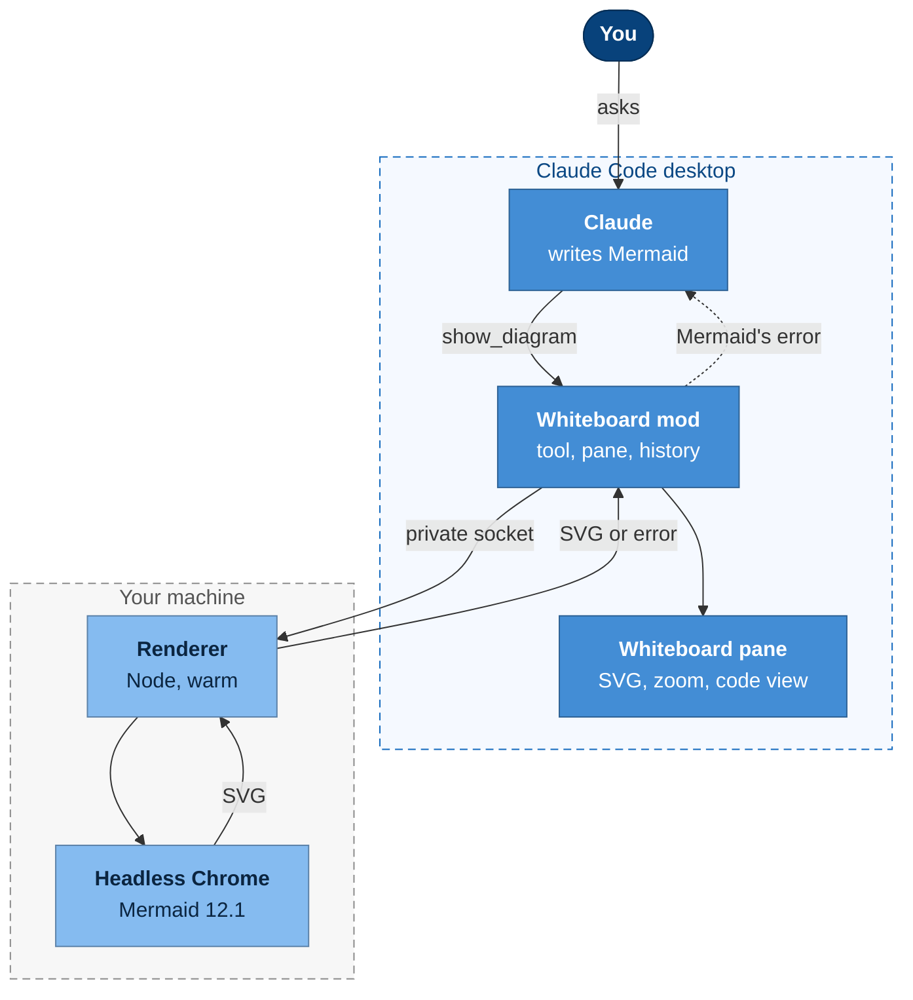
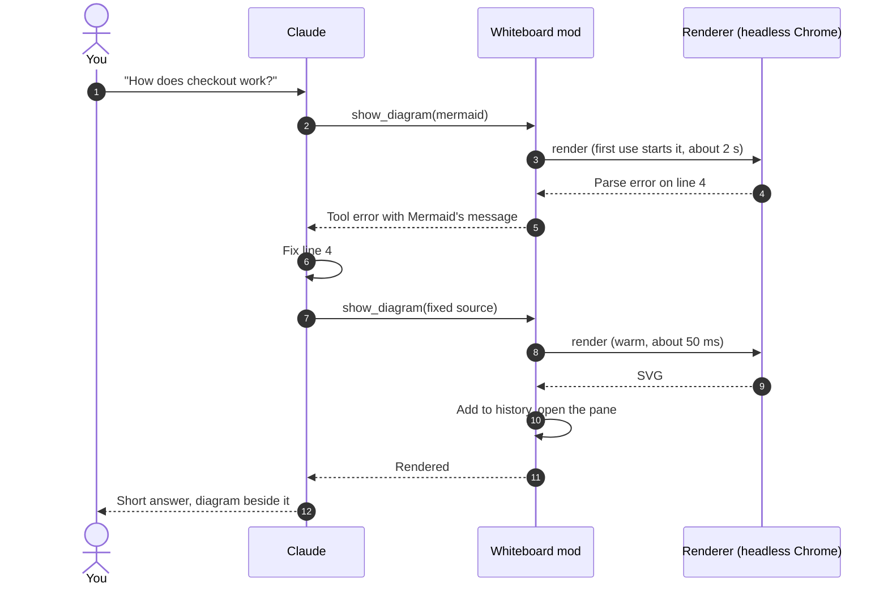

# Whiteboard for Claude Code

A whiteboard beside your Claude Code conversation. Ask Claude about a system, a
flow or a schema, and it draws a diagram there while it answers: real
[Mermaid](https://mermaid.js.org), rendered exactly as Mermaid draws it, every
diagram type, on a pane that keeps the whole conversation's diagrams.

<!-- GIF: the Shopwise walkthrough in demo/WALKTHROUGH.md -->

> **Community project, not affiliated with or endorsed by Anthropic.** Claude and
> Claude Code are trademarks of Anthropic, PBC.
>
> **Experimental.** Built on Claude Code's early-access mod API, which may change
> between releases. Tested with Claude Code 2.1.286 on macOS.

## What it does

- **Claude draws while it explains.** A `show_diagram` tool lets Claude put a
  diagram on the whiteboard whenever a picture says it better.
- **Exact Mermaid.** Mermaid 12.1 renders in a headless browser, so flowcharts,
  sequence, class, state, ER, C4, architecture, mindmaps, Gantt charts and the rest
  look exactly as they would on mermaid.live, styling and themes included.
- **Fixes its own mistakes.** When Mermaid rejects a diagram, its error goes back
  to Claude, which corrects the source and draws again; you just see the result.
- **History.** Each diagram is kept: step back and forth through a whole
  walkthrough, from the big picture down to the details.
- **Zoom, pan and source.** Zoom in on a large diagram, pan around it, or flip to
  the Mermaid source.

## How it works



The mod adds the tool, the pane and the `/whiteboard` command. Drawing happens
in a small renderer process: Node.js driving a headless Chrome with Mermaid
loaded, started on first use and kept warm, so after a first render of about two
seconds each diagram takes tens of milliseconds.



## Install

Requirements: Claude Code desktop with mods, Node.js 22.12 or later, and macOS
(Linux should work but is untested; Windows is not supported yet).

1. Load the plugin: `claude --plugin-dir /path/to/whiteboard-for-claude-code`.
2. In a session, run `/whiteboard setup`. It installs into `~/.cache/whiteboard`:
   `puppeteer-core` and Mermaid's script (about 35 MB). It uses the Chrome, Edge,
   Brave or Chromium already installed; only without one does it download a
   headless Chrome (about 150 MB). `/whiteboard setup --download-browser` forces
   the download.

## Use

Ask for a picture ("draw the auth flow", "show me the data model") or just ask
questions about a system: Claude draws when a diagram helps. The bundled
`whiteboard:drawing` skill teaches it to keep diagrams legible.

| Command | |
|---|---|
| `/whiteboard` | Open the whiteboard |
| `/whiteboard path/to/file.mmd` | Show a Mermaid file (or the first `mermaid` block of a Markdown file) |
| `/whiteboard theme <name>` | `auto` (follows light/dark), `default`, `dark`, `forest`, `neutral`, `base` |
| `/whiteboard sample` | Draw a sample |

Click the pane, then:

| Key | | Key | |
|---|---|---|---|
| `i` / `o` | zoom in / out | `w` `a` `s` `d` | pan |
| `0` | fit | `c` | Mermaid source |
| `p` / `n` | previous / next diagram | | |

## Security and privacy

- Rendering stays on your machine: no CDN, no network calls, nothing published.
  Only `/whiteboard setup` goes online, to fetch packages from npm.
- Mermaid runs with `securityLevel: strict` (no scripts or click callbacks) and
  labels as plain SVG text, in a headless browser with its sandbox on and a
  throwaway profile: your own browsing data is never read.
- The renderer listens on a Unix socket with a random name in a private
  directory (`0700`, socket `0600`), removed when it exits after 30 idle minutes.

## Limits

- The rendered view needs the desktop app (or VS Code): the terminal has no SVG,
  so there the whiteboard shows the Mermaid source.
- Diagrams over about 128 KB of SVG are too large for the pane; split them.
- Mermaid's own C4 syntax is experimental and lays out poorly; the skill steers
  Claude to C4-styled flowcharts instead.

## Development

```
claude plugin validate .
claude plugin test .
```

`demo/` holds a six-step walkthrough with reference diagrams and their renders;
`fixtures/` one diagram per type. `node scripts/render.mjs file.mmd...` renders
any Mermaid file to PNG with the same renderer the pane uses.

## License

MIT. Mermaid (MIT) and Puppeteer (Apache 2.0) are downloaded by setup, not
bundled.

This is an independent, unofficial project. It is not affiliated with, endorsed
by or supported by Anthropic. Claude and Claude Code are trademarks of
Anthropic, PBC, used here only to describe what the project works with.
