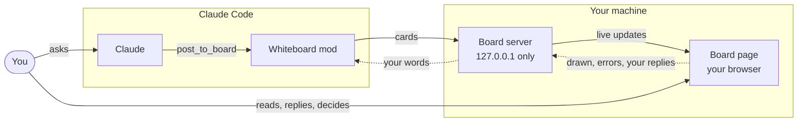

# Whiteboard

**A whiteboard beside your Claude Code session: Claude draws as it explains, you answer and decide on the board, and the whole discussion stays in the session.**

- **Diagrams as Claude explains.** Real [Mermaid](https://mermaid.js.org), every
  type, on a page in your browser, with zoom, a legend and sticky notes.
- **A two-way board.** What you type or click there goes into the same Claude
  Code session; Claude answers on the board.
- **Decide together.** Claude lays out what decides a design, you settle it
  with clicks, and one question can get a board of its own.
- **Nothing to set up.** Node.js 18 and the plugin. The board runs on
  127.0.0.1, downloads nothing, and ends with the session.


<sub>A real Claude Code session, sped up while Claude works. The clicks and words on the board were made by a script standing in for the user.</sub>

> **Open source, not affiliated with or endorsed by Anthropic.** Claude and
> Claude Code are trademarks of Anthropic, PBC. For Claude Code in a terminal
> or the Code tab of the Claude desktop app (not its Chat or Cowork modes,
> claude.ai or `claude -p`). **Experimental:** built on Claude Code's mods,
> which are new. Tested on macOS with Claude Code 2.1.295.

## Try it

Install it (below), start a new session, and paste one of these:

```
How does OAuth work? Show me on the whiteboard.
```

```
Let's design the checkout flow for our shop on the whiteboard. Settle the
constraints with me before proposing anything.
```

```
Checkout is slow since the last release. Investigate it on the whiteboard:
draw the request path with every step grey, redraw it as you find evidence,
and pin any fix as a sticky note before you draw it in.
```

Then answer on the page: your reply goes into the session, and Claude answers
on the board.

## What the board does

- **Diagrams, one tab each.** A redraw keeps its zoom and place, so stepping
  through the tabs shows what changed. Colours say what is known: grey not
  checked, green fine, red a problem, lavender a proposed change.
- **A brief beside them.** The bottom line first, then a few one-line
  sections. Point at one and its boxes light up; click it to ask, and the
  answer lands under it. Rewritten lines show what they replaced.
- **Decisions.** Constraints, each with its choices and the one Claude leans
  towards. Click yours; the diagram dashes what is still open, and Claude
  proposes the design once nothing is.
- **Side boards.** Say "let's whiteboard this" about one question and Claude
  opens a board for it, such as a comparison of the options. Pick one: the
  main board's constraint is settled and you are back there.
- **Charts you can click.** Click a slice, bar or point and it goes with your
  question.
- **Edit together.** On a canvas, drag, write and connect boxes; Claude reads
  your changes and amends the diagram in place.
- **Sticky notes** for a proposal or a question, beside the box it is about.
- **Mermaid errors go back to Claude,** which fixes the source and draws again.
- **Save it.** Export a diagram (SVG, PNG, `.excalidraw`), or save the board as
  one web page or as Markdown for a pull request or a postmortem.
- **Wrap up.** One button: Claude sums up in the conversation and the page
  closes.

It works for questions about your project ("how does checkout work?") and
general ones ("how does TLS work?"). Desktop windows get the most out of it;
on a narrow screen the board and the conversation take turns.

## Install

Requirements: Claude Code 2.1.287 or later and Node.js 18 or later, on macOS
(found on your PATH or where nvm, volta, fnm, asdf or mise put it). Linux
should work but is untested; Windows is not supported yet.

- **In the Claude desktop app:** Settings, plugins section: add the
  marketplace `mazzucci/whiteboard`, then install **whiteboard**.
- **In a terminal:**

  ```bash
  claude plugin marketplace add mazzucci/whiteboard
  ```

  ```bash
  claude plugin install whiteboard@mazzucci
  ```

Then start a new session; the first diagram opens the board. The desktop app
warns that a third-party plugin runs code on your machine: see
[Security and privacy](#security-and-privacy) for what this one runs.

**Update:** `claude plugin marketplace update mazzucci`, then
`claude plugin update whiteboard@mazzucci`, and a new session.
**Uninstall:** `claude plugin uninstall whiteboard@mazzucci`.
**From a clone:** `claude --plugin-dir /path/to/whiteboard/plugin`.

Or ask Claude: _"Install the whiteboard plugin from
https://github.com/mazzucci/whiteboard, following the Instructions for Claude
in its README."_

<details>
<summary>Instructions for Claude</summary>

You are installing this plugin for the person you are working with. Follow
these steps in order, and stop to tell them if one fails.

1. **Check the requirements.** Run `node --version`: it must be 18 or later
   (a Node from nvm, volta, fnm, asdf or mise counts). The OS must be macOS or
   Linux. If either check fails, stop and say which.
2. **Tell the person what will happen, and wait for their go-ahead:** Claude
   Code adds this repository as a plugin marketplace and installs the
   `whiteboard` plugin from it. Nothing else is downloaded. When Claude draws,
   the plugin runs a small local server (127.0.0.1 only) and opens a page in
   their browser.
3. **Install with Claude Code's plugin manager.** If `claude` is on the PATH,
   run `claude plugin marketplace add mazzucci/whiteboard`, then
   `claude plugin install whiteboard@mazzucci`. If it is already installed,
   update it instead with `claude plugin marketplace update mazzucci` and
   `claude plugin update whiteboard@mazzucci` (an older install goes by
   `whiteboard@whiteboard`: use `whiteboard` as the marketplace name in both
   commands). If `claude` is not on the PATH (often the case for desktop app
   users), ask the person to add the marketplace `mazzucci/whiteboard` in the
   desktop app's Settings, plugins section, and install **whiteboard** from it.
4. **Tell the person the next steps:** start a new Claude Code session (plugins
   load when a session starts), then ask for a walkthrough or a diagram. If
   `/whiteboard` is missing in the new session, the mod did not load: check
   that their Claude Code version supports mods.

Do not clone the repository by hand, and do not change their Claude Code
settings, permissions or other plugins as part of this install.

</details>

<details>
<summary>Older installs</summary>

**Installed as `whiteboard@whiteboard`?** The marketplace was called
`whiteboard` until 0.2.2. Your install keeps updating under that name (use
`whiteboard` in place of `mazzucci` above), or move: `claude plugin marketplace
remove whiteboard`, add `mazzucci/whiteboard` again and install
`whiteboard@mazzucci`.

**Upgrading from 0.1?** Delete `~/.cache/whiteboard` after updating: later
versions need no headless Chrome.

</details>

## Use

Ask for a walkthrough, a picture or a decision; say "on the whiteboard" to be
sure. `/whiteboard focus` moves the discussion to the board until you press
**Wrap up**.

| Command | |
|---|---|
| `/whiteboard` | Open the board (again, if you closed its tab) |
| `/whiteboard focus` | Discuss on the board until you wrap up |
| `/whiteboard canvas` | Open it in canvas mode: edit the diagrams together |
| `/whiteboard path/to/file.mmd` | Show a Mermaid file (or a Markdown file's first `mermaid` block) |
| `/whiteboard sample` | Draw a sample |

<details>
<summary>Keys on the board</summary>

| | |
|---|---|
| Tabs, or `[` / `]` | previous / next diagram |
| `i` / `o`, pinch, Ctrl+scroll | zoom in / out |
| `f`, double-click, double-tap | fit the diagram |
| drag, arrow keys | pan |
| `c` | Mermaid source, with Copy |
| Enter | send (Shift+Enter for a new line) |

</details>

<details>
<summary>How it works</summary>

The plugin gives Claude three tools, `post_to_board`, `edit_board` and
`read_board`, and the `/whiteboard` command. The first post starts a small
server for the session (Node's standard library, nothing installed) and opens
its page in your browser. The page draws with the Mermaid bundled in the
plugin and edits with the bundled Excalidraw; what you type or click there is
submitted into the session as your own words. Each session has its own board,
labelled with its folder's name. The bundled `whiteboard:drawing` skill teaches
Claude to keep diagrams legible and honest: real names, `file:line`
citations, and colours that say how much is known.



</details>

## Security and privacy

The board is a small web server on your machine, and what is typed on its page
goes into your session as your own words.

- **The board's link is a key.** Its random token lets whoever has it send
  messages into your session as you. Don't share it; once the page loads, the
  token leaves the address bar.
- **Local only.** 127.0.0.1, a random port, its own host name only, no other
  website even with the token, JSON only.
- **Nothing downloaded, nothing sent.** Mermaid and Excalidraw are bundled;
  the page loads only from the board itself.
- **Inert content.** Mermaid runs in strict mode; notes are an escaped
  Markdown subset with http(s) links only.
- **Only what you do.** The page sends a message only when you press Send or
  Wrap up, and cannot answer Claude Code's permission prompts.
- **Gone with the session.** Everything is in memory; nothing is written unless
  you export or save, and a saved page runs no scripts.

<details>
<summary>Limits</summary>

- One board per session; restarting Claude Code ends it (the page stays
  readable). `claude -p` has no board.
- The board opens in your default browser (set `BROWSER` to use another) and
  only on the machine running Claude Code.
- A brief has at most nine sections; side boards are one level deep, three
  open at a time.
- Sticky notes sit beside a box in flowcharts, beside the diagram otherwise.
  Section highlights work on flowcharts, sequence diagrams and charts.
- A diagram you edit keeps its boxes, colours and arrows but not every Mermaid
  detail; gantt, pie and other types without boxes cannot be edited.

</details>

## Development

```
claude plugin validate --strict plugin
claude plugin test plugin
node --test plugin/tests/server.test.mjs
cd test && npm ci && npm test            # the page in headless Chrome
cd editor && npm ci && node check-build.mjs   # the vendored editor matches its source
```

CI runs them on every pull request. `plugin/` is all an install copies;
`editor/` builds the canvas editor, `demo/` holds the simulated investigation
and the recording guide, `media/` the GIF and its scripts. Changes are in
[CHANGELOG.md](CHANGELOG.md). Questions, bugs and ideas:
[GitHub Issues](https://github.com/mazzucci/whiteboard/issues).

## License

MIT. The bundled Mermaid is MIT licensed (the libraries in its bundle keep
their own licences, including the Eclipse Layout Kernel under EPL-2.0); the
canvas editor bundles Excalidraw, its Mermaid converter and React (MIT) and
fonts under the SIL Open Font License or MIT. See
[`plugin/board/vendor/README.md`](plugin/board/vendor/README.md).

This is an independent, unofficial project, not affiliated with, endorsed by or
supported by Anthropic. Claude and Claude Code are trademarks of Anthropic,
PBC, used here only to describe what the project works with.
