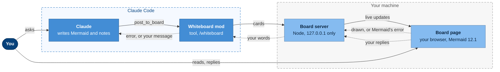
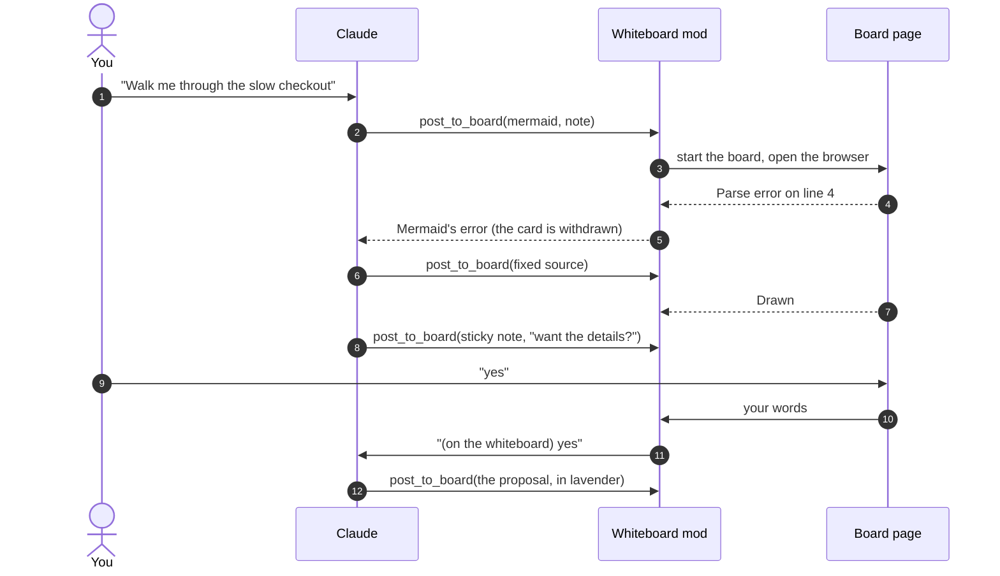

# Whiteboard

A whiteboard for your Claude Code conversation: a page in your browser where
Claude draws while it explains, and where you can answer back. Ask Claude to
walk you through an investigation, a system or a flow, and the diagrams build
up on the board as it goes: real [Mermaid](https://mermaid.js.org), every
diagram type, with zoom, pan, a legend and sticky notes, and the conversation
beside them.


<sub>A recording of a real Claude Code session, sped up while Claude works. The project is simulated (`demo/checkout-service/`); Claude, the plugin and every diagram are real, and the replies on the board were typed by a script standing in for the user.</sub>

> **Open source project, not affiliated with or endorsed by Anthropic.** Claude and
> Claude Code are trademarks of Anthropic, PBC.
>
> **For Claude Code,** in a terminal or in the Code tab of the Claude desktop
> app. It does not work in the desktop app's **Claude** (chat) or **Cowork**
> modes, on claude.ai, or with `claude -p`.
>
> **Experimental.** Built on Claude Code's mods, which are new and may change
> between releases. Tested in macOS Terminal with Claude Code 2.1.289.

## Why a whiteboard?

The same question to Claude Code, without and with the whiteboard: "How does
OAuth work?", then a follow-up asked on the board.


<sub>Both halves are real Claude Code sessions. "Without" is snapshots of the Terminal window as the answer streamed in; "with" is a recording of the board, with snapshots of the same session's Terminal, and the follow-up typed by a script standing in for the user.</sub>

## What it does

The whiteboard is a visual companion to the conversation. Claude puts a picture
on it whenever a picture says it better, and redraws as the conversation moves:
the hypothesis first, then what the evidence shows, then a proposed fix.

- **Diagrams as they come.** Each diagram is a tab across the top of the board;
  the newest opens as it arrives. A redraw keeps its place on screen, so only
  what changed moves.
- **Zoom, pan, source.** Pinch or Ctrl+scroll to zoom, drag or use the arrow
  keys to pan, Fit to see it whole, Code for the Mermaid source.
- **Colours that answer one question each,** with a legend: grey, not measured
  yet; green, no problem; red, a problem; lavender, a proposed change.
- **Sticky notes.** Claude pins a proposal or a question beside the box it is
  about, without changing the diagram, and asks before drawing it in.
- **Fixes its own mistakes.** The page draws each diagram with Mermaid and tells
  Claude how it went: when Mermaid rejects one, the error goes back to Claude,
  which corrects the source and draws again. You only see the result.
- **Talk back on the board.** Claude's notes appear beside the diagrams, and
  what you type there goes into the same Claude Code session, as if you had
  typed it in the terminal. The page shows when your message is sent and when
  Claude is working on it.
- **Wrap up.** One button asks Claude to summarise what you concluded in the
  conversation; then the page closes itself, and the session keeps everything
  you discussed.

## How it works



The mod gives Claude one tool, `post_to_board`, and the `/whiteboard` command.
The first post starts a small server for the session (Node's standard library,
nothing installed) and opens its page in your browser. The page draws with the
Mermaid bundled in the plugin, so nothing is downloaded and no CDN is used.
Each session has its own board, labelled with its folder's name.



## Install

Requirements: Claude Code 2.1.287 or later (mods are on by default from that
version) and Node.js 18 or later, on macOS. Linux should work but is untested;
Windows is not supported yet.

This repository is its own plugin source: Claude Code reads the plugin list in
`.claude-plugin/marketplace.json` and installs `whiteboard` from the `plugin/`
folder, nothing else. Add the repository as a marketplace, then install
`whiteboard` from it:

- **In the Claude desktop app:** open Settings, find the plugins section, add
  the marketplace `mazzucci/whiteboard`, then install **whiteboard** from it.
- **In a terminal:**

  ```bash
  claude plugin marketplace add mazzucci/whiteboard
  ```

  ```bash
  claude plugin install whiteboard@mazzucci
  ```

  `whiteboard@mazzucci` is the plugin `whiteboard` from the marketplace
  `mazzucci`, the name this repository's plugin list goes by.

Claude Code warns that this marketplace is not Anthropic's and that a plugin
runs code on your machine. That is expected for a third-party plugin: see
[Security and privacy](#security-and-privacy) for what this one runs.

Then start a new session. There is no setup step: the first diagram opens the
board.

To update, refresh the marketplace first so Claude Code sees the new version,
then update the plugin and start a new session (desktop app: Settings, plugins
section; terminal: `claude plugin marketplace update mazzucci`, then
`claude plugin update whiteboard@mazzucci`). To uninstall:
`claude plugin uninstall whiteboard@mazzucci`, and optionally
`claude plugin marketplace remove mazzucci`.

**Installed as `whiteboard@whiteboard`?** The marketplace was called
`whiteboard` until version 0.2.2. Your install keeps working and updating
under that name (use `whiteboard` in place of `mazzucci` above). To move to
the new name: `claude plugin marketplace remove whiteboard`, then add
`mazzucci/whiteboard` again and install `whiteboard@mazzucci`.

**Upgrading from 0.1?** Version 0.1 drew in a pane of the desktop app with a
headless Chrome that `/whiteboard setup` downloaded into `~/.cache/whiteboard`.
Version 0.2 needs none of it: run `/whiteboard uninstall` once before updating,
or delete `~/.cache/whiteboard` afterwards.

### Ask Claude to install it

In Claude Code, paste:

```
Install the whiteboard plugin from https://github.com/mazzucci/whiteboard,
following the "Instructions for Claude" in its README.
```

### Instructions for Claude

You are installing this plugin for the person you are working with. Follow
these steps in order, and stop to tell them if one fails.

1. **Check the requirements.** Run `node --version`: it must be 18 or later.
   The OS must be macOS or Linux. If either check fails, stop and say which.
2. **Tell the person what will happen, and wait for their go-ahead:** Claude
   Code adds this repository as a plugin marketplace and installs the
   `whiteboard` plugin from it. Nothing else is downloaded. When Claude draws,
   the plugin runs a small local server (127.0.0.1 only) and opens a page in
   their browser.
3. **Install with Claude Code's plugin manager.** If `claude` is on the PATH,
   run `claude plugin marketplace add mazzucci/whiteboard`, then
   `claude plugin install whiteboard@mazzucci`. If it is already installed,
   update it instead with `claude plugin marketplace update mazzucci` and
   `claude plugin update whiteboard@mazzucci` (an older install goes by
   `whiteboard@whiteboard`: use `whiteboard` as the marketplace name in both
   commands). If `claude` is not on the
   PATH (often the case for desktop app users), ask the person to add the
   marketplace `mazzucci/whiteboard` in the desktop app's Settings, plugins
   section, and install **whiteboard** from it.
4. **Tell the person the next steps:** start a new Claude Code session (plugins
   load when a session starts), then ask for a walkthrough or a diagram. If
   `/whiteboard` is missing in the new session, the mod did not load: check
   that their Claude Code version supports mods.

Do not clone the repository by hand, and do not change their Claude Code
settings, permissions or other plugins as part of this install.

### Try it from a clone

`claude --plugin-dir /path/to/whiteboard/plugin` loads a local copy for one
session.

## Use

Ask for a walkthrough ("walk me through this investigation", "how does
checkout work?") or a picture ("draw the auth flow"), and Claude draws when a
diagram helps. The bundled `whiteboard:drawing` skill teaches it to keep
diagrams legible and honest.

To take a discussion "offline", run `/whiteboard focus`: Claude answers on the
board, and you discuss there until you press **Wrap up**.

| Command | |
|---|---|
| `/whiteboard` | Open the board (again, if you closed its tab) |
| `/whiteboard focus` | Discuss on the board until you wrap up |
| `/whiteboard path/to/file.mmd` | Show a Mermaid file (or the first `mermaid` block of a Markdown file) |
| `/whiteboard sample` | Draw a sample |

On the board:

| | |
|---|---|
| Tabs, or `[` / `]` | previous / next diagram |
| `i` / `o`, pinch, Ctrl+scroll | zoom in / out |
| `f` | fit the diagram to the board |
| drag, arrow keys | pan |
| `c` | Mermaid source, with Copy |
| Enter | send your reply (Shift+Enter for a new line) |

## Reading the diagrams

A polished diagram makes a guess look like a fact, so the bundled skill asks
Claude to show the difference: real module, file and service names, the
mechanism on each edge, `file:line` citations in the answer, and colours that
say how much is known. Each colour answers one question, and has its own
border so it reads without colour too:

| | |
|---|---|
| grey, dashed | not checked or measured yet |
| green | checked, no problem |
| red | checked, a problem |
| lavender, dashed | a proposed change, not made or measured yet |

While troubleshooting, Claude starts from a hypothesis with every step grey,
and redraws the same diagram as evidence comes in, so the tabs read as the
investigation. A fix starts as a sticky note on the box it changes; when you
want it, Claude redraws the diagram with the change in lavender.

The same recipe colours a diagram by any **lens**: risk across a change, test
coverage, the progress of a CI pipeline or a migration, or one you invent ("by
owner", "by latency"). These are conventions in the skill, not features of the
board: any Mermaid works.

## Security and privacy

- **Local only.** The board server listens on 127.0.0.1, on a random port, and
  answers only requests carrying the session's random token and its own host
  name, so other sites and other machines cannot reach it.
- **Nothing downloaded, nothing sent.** Mermaid is bundled in the plugin. The
  page loads nothing from the network (its content security policy allows only
  the board itself), and diagrams are drawn in your browser.
- **Mermaid in strict mode:** no scripts or click callbacks in diagrams, labels
  as plain SVG text. Notes are a small Markdown subset, escaped, with links only
  to http and https.
- **Only what you type.** The page submits a message into the session only when
  you press Send or Wrap up. It cannot approve Claude Code's permission prompts
  or run anything.
- **Gone with the session.** The board keeps everything in memory, and stops
  when the session ends or after Wrap up.

## Limits

- One board per session. Restarting Claude Code (or the plugin) ends it; the
  open page then says so and stays readable.
- `claude -p` has no board: nobody could reply to it.
- The board opens in your default browser (in the desktop app too, not inside
  the app). To use another, set `BROWSER` to its command before starting
  Claude Code.

## Development

```
claude plugin validate --strict plugin
claude plugin test plugin
```

`plugin/` is everything Claude Code loads, and all an install copies: the mod
(`hooks/`), the board server and its page (`board/`, with Mermaid in
`board/vendor/`), the drawing skill (`skills/`) and the tests. The rest of the
repository is the project around it: `demo/` holds the simulated checkout
investigation and a walkthrough with reference diagrams; `fixtures/` one
diagram per type; `media/` the README's GIFs, the scripts that record and edit
them (`media/board-demo/`, see `demo/RECORDING.md`) and the 0.1 explainer
video's sources.

## License

MIT. The bundled Mermaid is MIT licensed (see `plugin/board/vendor/`).

This is an independent, unofficial project. It is not affiliated with, endorsed
by or supported by Anthropic. Claude and Claude Code are trademarks of
Anthropic, PBC, used here only to describe what the project works with.
