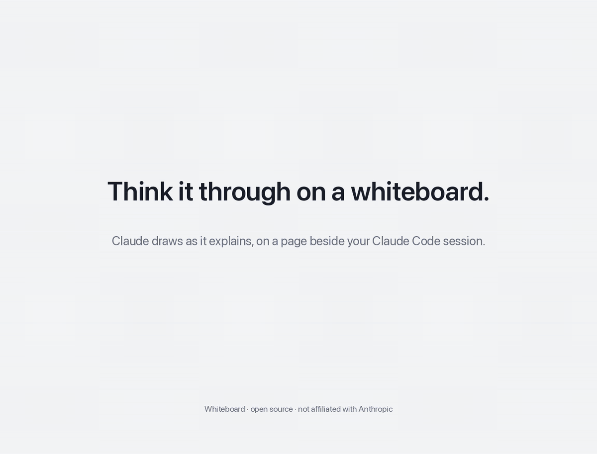
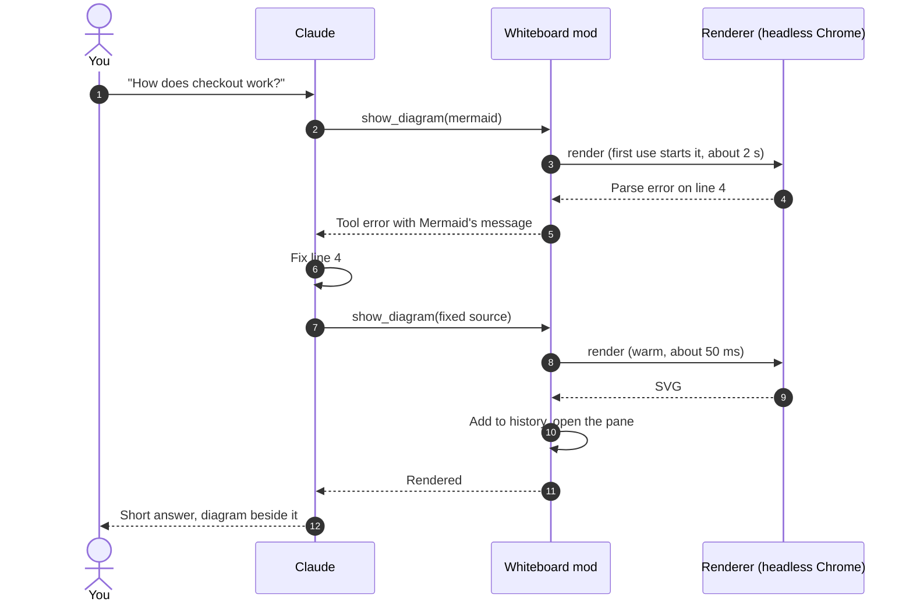

# Whiteboard for Claude Code

A whiteboard beside your Claude Code conversation. Ask Claude about a system, a
flow or a schema, and it draws a diagram there while it answers: real
[Mermaid](https://mermaid.js.org), rendered exactly as Mermaid draws it, every
diagram type, on a pane that keeps the whole conversation's diagrams.



<sub>Animated illustration, not a screen recording; the diagrams are real Mermaid renders. Sources in `media/explainer/`.</sub>

> **Open source project, not affiliated with or endorsed by Anthropic.** Claude and
> Claude Code are trademarks of Anthropic, PBC.
>
> **Experimental.** Built on Claude Code's mods, which are new and may change
> between releases. Tested with Claude Code 2.1.286 on macOS.

## What it does

More than a diagram renderer, the whiteboard is a visual companion to the
conversation. Claude redraws as the conversation moves, and colours a diagram by
whatever matters right now, with a legend that says what the colours mean: what
is confirmed and what is still a guess while troubleshooting, where the risk sits
in a change, which CI step has passed, is running or failed. Each redraw stays in
the history, so the whiteboard becomes a timeline of how the picture changed.

- **Claude draws while it explains.** A `show_diagram` tool lets Claude put a
  diagram on the whiteboard whenever a picture says it better.
- **Exact Mermaid.** Mermaid 12.1 renders in a headless browser, so flowcharts,
  sequence, class, state, ER, C4, architecture, mindmaps, Gantt charts and the rest
  look exactly as they would on mermaid.live, styling and themes included.
- **Fixes its own mistakes.** When Mermaid rejects a diagram, its error goes back
  to Claude, which corrects the source and draws again; you just see the result.
- **History.** Each diagram is kept: step back and forth through a whole
  walkthrough, from the big picture down to the details.
- **Zoom, pan and source.** Zoom in on a large diagram, pan around it, or flip to
  the Mermaid source.

## How it works


The mod adds the tool, the pane and the `/whiteboard` command. Drawing happens
in a small renderer process: Node.js driving a headless Chrome with Mermaid
loaded, started on first use and kept warm, so after a first render of about two
seconds each diagram takes tens of milliseconds.



## Install

Requirements: Claude Code 2.1.287 or later (mods are on by default from that
version), Node.js 22.12 or later, and macOS (Linux should work but is
untested; Windows is not supported yet).

**Works in the Claude Code desktop app's Code tab**, where the diagram is live
SVG and zooming and panning are instant. Elsewhere (Claude Code in a terminal,
the desktop app's chat, the VS Code extension, `claude -p`) the plugin loads
but no whiteboard appears, and Claude is told to explain in prose instead.
Terminal support is in development on the
[`terminal`](https://github.com/mazzucci/whiteboard-for-claude-code/tree/terminal)
branch.

This repository is its own plugin source: Claude Code reads the plugin list
in `.claude-plugin/marketplace.json` here and installs `whiteboard` from the
`plugin/` folder, nothing else. Installing takes two steps: add the
repository as a marketplace, then install `whiteboard` from it.

- **In the Claude desktop app:** open Settings, find the plugins section, add
  the marketplace `mazzucci/whiteboard-for-claude-code`, then install
  **whiteboard** from it.
- **In a terminal:**

  ```bash
  claude plugin marketplace add mazzucci/whiteboard-for-claude-code
  claude plugin install whiteboard@whiteboard-for-claude-code
  ```

Claude Code warns that this marketplace is not Anthropic's and that a plugin
runs code on your machine. That is expected for a third-party plugin: see
[Security and privacy](#security-and-privacy) for what this one runs.

Then start a new session and run `/whiteboard setup` once. It first checks
for Node.js 22.12 or later, then **asks before each download**, naming what it
is, its size and where it goes:

1. `puppeteer-core` from npm (about 29 MB), into `~/.cache/whiteboard`
2. Mermaid's script from npm (about 5 MB), into `~/.cache/whiteboard`
3. only if no Chrome, Edge, Brave or Chromium is installed: a headless Chrome
   (about 150 MB) from Google's Chrome for Testing

Cancel stops it there; nothing else is downloaded, and running it again
picks up where it stopped. `/whiteboard setup --download-browser` offers the
headless Chrome even when a browser is installed.

To update later, refresh the marketplace first, so Claude Code sees the new
version, then update the plugin and start a new session: in the desktop app's
Settings, plugins section, or with
`claude plugin marketplace update whiteboard-for-claude-code` and
`claude plugin update whiteboard@whiteboard-for-claude-code`.

To uninstall:

1. `/whiteboard uninstall` stops the renderer and, after asking, deletes
   `~/.cache/whiteboard`.
2. `claude plugin uninstall whiteboard@whiteboard-for-claude-code` removes the
   plugin.
3. Optionally, `claude plugin marketplace remove whiteboard-for-claude-code`
   forgets this repository as a marketplace.

### Ask Claude to install it

In Claude Code, paste:

```
Install the whiteboard plugin from https://github.com/mazzucci/whiteboard-for-claude-code,
following the "Instructions for Claude" in its README.
```

Claude checks the requirements, tells you what it will install, and installs it
through Claude Code's plugin manager.

### Instructions for Claude

You are installing this plugin for the person you are working with. Follow
these steps in order, and stop to tell them if one fails.

1. **Check the requirements.** Run `node --version`: it must be 22.12 or
   later. The OS must be macOS or Linux. If either check fails, stop and say
   which.
2. **Tell the person what will happen, and wait for their go-ahead:** Claude
   Code adds this repository as a plugin marketplace and installs the
   `whiteboard` plugin from it. Later, `/whiteboard setup` downloads
   `puppeteer-core` (about 29 MB) and Mermaid's script (about 5 MB) from npm
   into `~/.cache/whiteboard`, plus a headless Chrome (about 150 MB) only if
   no Chrome, Edge, Brave or Chromium is installed, asking them before each
   download. Nothing is sent anywhere: diagrams render locally.
3. **Install with Claude Code's plugin manager.** If `claude` is on the PATH,
   run:
   - `claude plugin marketplace add mazzucci/whiteboard-for-claude-code`
   - `claude plugin install whiteboard@whiteboard-for-claude-code`

   If it is already installed, update it instead with
   `claude plugin marketplace update whiteboard-for-claude-code` and
   `claude plugin update whiteboard@whiteboard-for-claude-code`. If `claude`
   is not on the PATH (often the case for desktop app users), ask the person
   to add the marketplace `mazzucci/whiteboard-for-claude-code` in the desktop
   app's Settings, plugins section, and install **whiteboard** from it.
4. **Tell the person the next steps:** start a new Claude Code session (plugins
   load when a session starts), run `/whiteboard setup` there once (it asks
   before each download; you cannot run it for them), then ask for a
   diagram. If `/whiteboard` is missing in the new session, the mod did
   not load: check that their Claude Code version supports mods.

Do not clone the repository by hand, and do not change their Claude Code
settings, permissions or other plugins as part of this install.

### Try it from a clone

To try a local copy without installing it, load it for one session:
`claude --plugin-dir /path/to/whiteboard-for-claude-code/plugin`, then run
`/whiteboard setup`.

## Use

Ask for a picture ("draw the auth flow", "show me the data model") or just ask
questions about a system: Claude draws when a diagram helps. The bundled
`whiteboard:drawing` skill teaches it to keep diagrams legible.

| Command | |
|---|---|
| `/whiteboard` | Open the whiteboard |
| `/whiteboard path/to/file.mmd` | Show a Mermaid file (or the first `mermaid` block of a Markdown file) |
| `/whiteboard theme <name>` | `auto` (light), `default`, `dark`, `forest`, `neutral`, `base` |
| `/whiteboard sample` | Draw a sample |
| `/whiteboard setup` | Install the renderer, asking before each download |
| `/whiteboard uninstall` | Stop the renderer and delete its files, after asking |

Click the pane, then:

| Key | | Key | |
|---|---|---|---|
| `i` / `o` | zoom in / out (out all the way is fit) | `w` `a` `s` `d` | pan |
| `c` | Mermaid source | `r` | refresh |
| `p` / `n` | previous / next diagram | | |

## Reading the diagrams

A polished diagram makes a guess look like a fact, so the bundled skill asks
Claude to show the difference: real module, file and service names, the
mechanism on each edge, `file:line` citations in the answer, and styles that say
how much is known.

Beyond that, a diagram can be coloured by any **lens**: one property, a few
levels, one style per level, and a legend. Some examples:

- **Confidence.** Confirmed parts are solid green, suspects thick amber, parts
  not yet checked dashed grey, ruled-out branches dotted red with a ✗. While
  troubleshooting, Claude starts from a hypothesis and redraws it as evidence
  comes in, so the history reads as the investigation.
- **Risk, performance or test coverage** across a change, or **before and after**
  with added, changed and removed parts.
- **Progress** of anything with steps: a CI pipeline (done, running, waiting,
  failed), a rollout, a migration, a long task Claude is working through.

Invent your own: ask for a diagram "coloured by owner", "by latency", "by what we
have touched so far". Every colour gets its own border style, so diagrams read
in grayscale too. These are conventions in the skill, not features of the
renderer: any Mermaid works.

## Security and privacy

- Rendering stays on your machine: nothing is published, and the renderer's
  page may load nothing but inline data, so a diagram naming a remote image or
  URL cannot make it reach the network (such a diagram fails with an error).
- Only `/whiteboard setup` goes online, and only after you agree to each
  download: `puppeteer-core` and Mermaid's package from the npm registry
  (integrity-checked by npm), and, only when no Chromium browser is installed,
  a headless Chrome from Google's Chrome for Testing through Puppeteer's
  installer. `/whiteboard uninstall` deletes all of it.
- Mermaid runs with `securityLevel: strict` (no scripts or click callbacks) and
  labels as plain SVG text, in a headless browser with its sandbox on and a
  throwaway profile: your own browsing data is never read.
- The renderer listens on a Unix socket with a random name in a private
  directory (`0700`, socket `0600`), removed when it exits after 30 idle minutes.

## Limits

- The Claude desktop app's Code tab only, for now: in a terminal the pane
  shows the Mermaid source. Terminal support is in development on the
  `terminal` branch.
- Diagrams over about 128 KB of SVG are too large for the pane; split them.
- Mermaid's own C4 syntax is experimental and lays out poorly; the skill steers
  Claude to C4-styled flowcharts instead.

## Development

```
claude plugin validate --strict .
claude plugin test plugin
```

`plugin/` is everything Claude Code loads, and all an install copies: the mod
(`hooks/`), the renderer it runs (`renderer/`), the drawing skill (`skills/`),
its types and tests. The rest of the repository is the project around it:
`demo/` holds a six-step walkthrough with reference diagrams and their renders;
`fixtures/` one diagram per type. `node scripts/render.mjs file.mmd...` renders
any Mermaid file to PNG with the same renderer the pane uses.

## License

MIT. Mermaid (MIT) and Puppeteer (Apache 2.0) are downloaded by setup, not
bundled.

This is an independent, unofficial project. It is not affiliated with, endorsed
by or supported by Anthropic. Claude and Claude Code are trademarks of
Anthropic, PBC, used here only to describe what the project works with.
