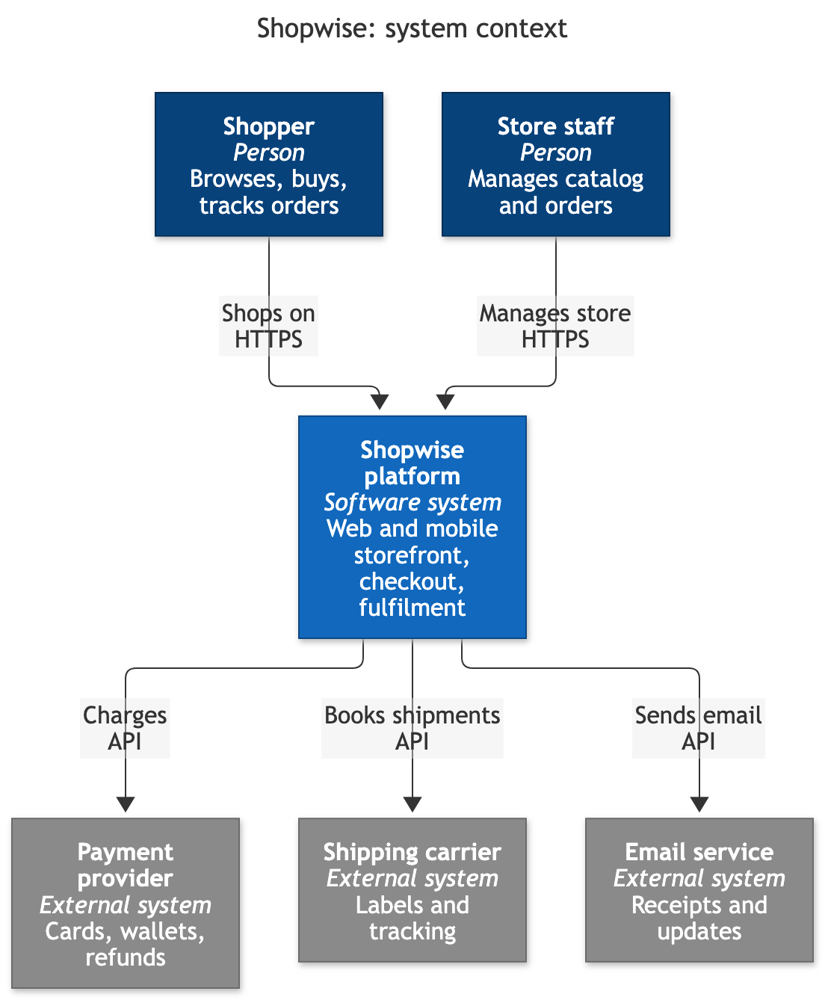
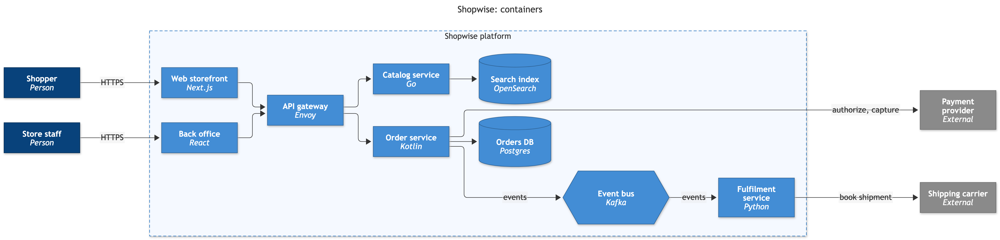
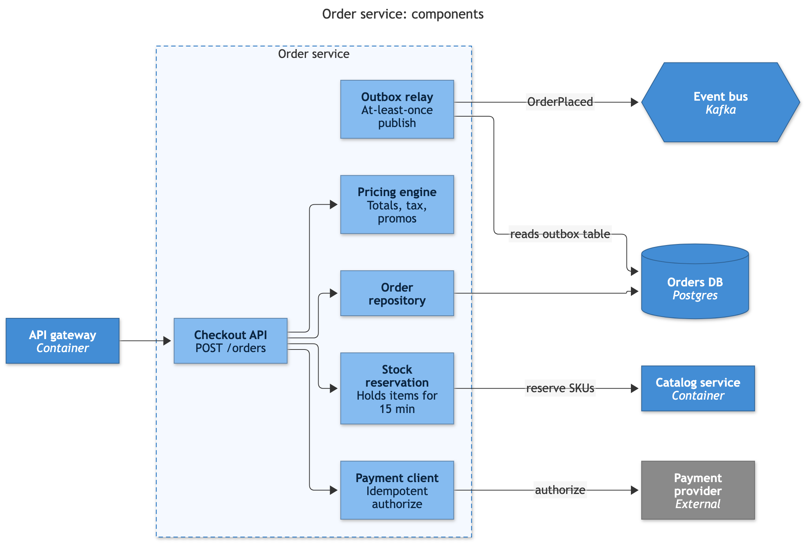
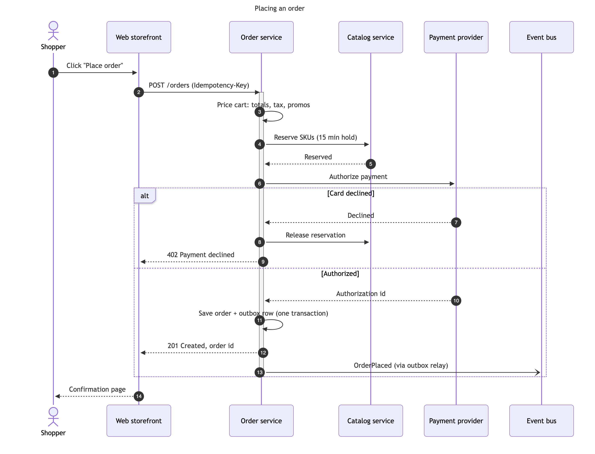
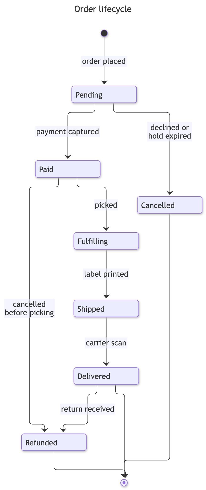
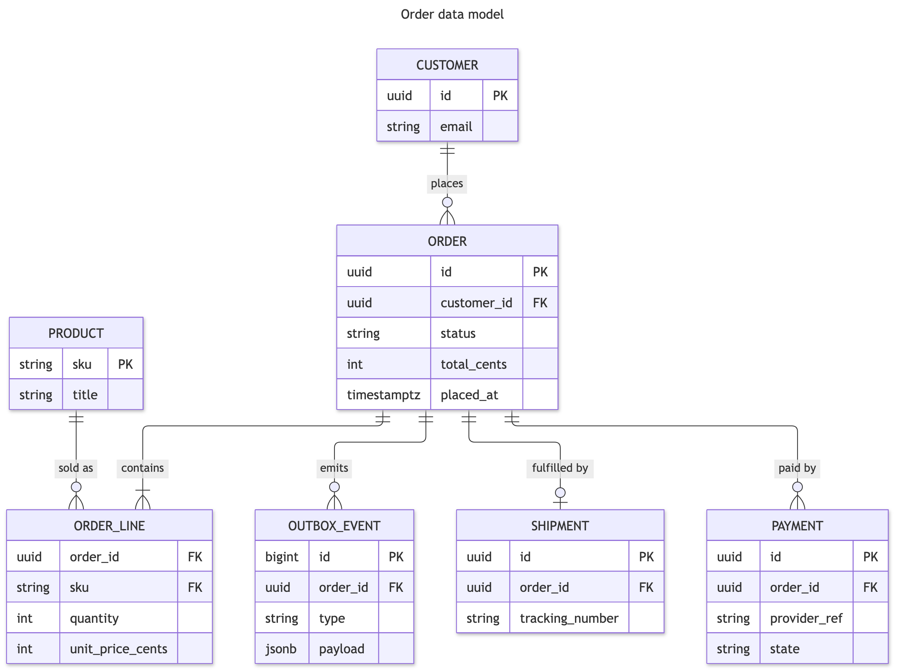

# Demo walkthrough: exploring "Shopwise", an e-commerce platform

Six questions, each answered with prose and a new diagram in the pane. The
pane's history lets the viewer step back (`p`) and forward (`n`) through the
whole zoom from the big picture down to the data. The `.mmd` files beside this
one are reference answers, checked for crisp layout (no overlapping text or
lines); Claude writes its own each time, so they guide rather than script it.

Before recording: start a fresh session in Claude desktop, open the pane with
`/whiteboard`, set `/whiteboard theme default` (white background reads best on
video), and say once: "Answer each question in two or three sentences and
draw a diagram for it."

| # | Ask | Diagram | Reference |
|---|---|---|---|
| 1 | "Imagine an e-commerce platform called Shopwise. What does it look like from the outside: who uses it and what does it depend on?" | C4 system context | `1-context.mmd` |
| 2 | "Zoom in: what's inside the platform?" | C4 containers, left to right | `2-containers.mmd` |
| 3 | "How is the order service built?" | C4 components of the order service | `3-components.mmd` |
| 4 | "Walk me through what happens when a shopper places an order, including a declined card." | Sequence with an `alt` block | `4-checkout.mmd` |
| 5 | "What states can an order go through?" | State machine | `5-lifecycle.mmd` |
| 6 | "And how is it stored?" | Entity-relationship model | `6-data-model.mmd` |

Moments worth catching on camera:
- Step 2 or 3: press `i` twice and pan with `w a s d` across a wide diagram.
- Any step: press `c` to flip to the Mermaid source and back.
- The self-correction loop: Claude occasionally writes Mermaid that does not
  parse; the tool returns Mermaid's error and Claude fixes it on its own. To
  show it on purpose, ask for a sequence diagram with a note containing a
  semicolon (`;` ends a statement there).
- End with `p` stepping back through all six diagrams.

## The six reference diagrams

Rendered with the whiteboard's own renderer (Mermaid 12.1, `default` theme).
Regenerate after editing a source with
`node scripts/render.mjs --out demo/images demo/*.mmd`.

### 1. System context

### 2. Containers

### 3. Order service components

### 4. Placing an order

### 5. Order lifecycle

### 6. Order data model

