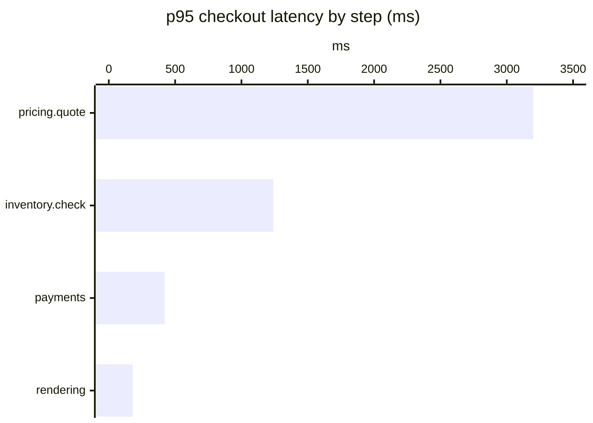

# Drawing on the whiteboard

`post_to_board` draws Mermaid on the whiteboard, a page in the person's
browser beside the conversation. Each diagram becomes a tab, so a sequence of
calls tells a story. Draw when a picture explains structure, flow or state
better than prose: several services or modules, a flow with branches or
retries, state transitions, a risky change, or how a protocol or standard
works (OAuth, TLS, DNS), even with no code in sight. For such a question, a
sequence diagram of the flow does most of the talking; put the gotchas (PKCE,
the `state` parameter) on sticky notes without `on`, which line up beside a
sequence diagram, or as `Note over` lines inside it. Not for a routine edit,
where a diagram is decoration. Answer in prose as well, briefly, and let the diagram carry the
detail.

A polished diagram makes a guess look like a fact. Draw only what you know, and
show the difference (see "Show what you know" below).

## Pick the type

| Question | Type |
|---|---|
| What are the parts and how do they connect? | `flowchart` (C4 style below for systems) |
| What happens, in what order, between whom? | `sequenceDiagram` |
| What states can it be in? | `stateDiagram-v2` |
| How is the data shaped? | `erDiagram` |
| What are the types and their relations? | `classDiagram` |
| When does what happen? | `gantt` or `timeline` |
| How do ideas branch? | `mindmap` |
| How big is each part of a whole? | `pie` (see Charts) |
| How do values compare, or change over time? | `xychart-beta` (bars and lines) |
| Where does each item fall on two scales? | `quadrantChart` |

## Keep it legible

The board fits each whole diagram to its stage at first (the person can zoom
and pan after); a diagram far wider or taller than the stage is fitted small,
until its text is hard to read.
- About 5 to 15 nodes. More than that: split it into two diagrams, or zoom one level out.
- Choose the direction by shape: a long chain reads best `TB`; a wide fan-out or
  a pipeline across a few lanes reads best `LR`. A diagram that renders as a thin
  strip (say 2000 × 250) or a tall column has the wrong direction.
- When one node calls four or more others, draw it `LR` so they stack down
  the page; side by side in `TB` they shrink the whole diagram to fit the width.
- Short labels: a name, then a second line of detail at most. Put explanations in your prose.
  A line wraps on its own only past about 400 px, so break with `<br/>` where you
  want it: `pay["payments.charge<br/>180 ms"]`, a file path on its own line.
- Label only edges whose meaning is not obvious ("events", "authorize"), and keep
  edge labels to a word or two.
- A `title` in front matter (`---\ntitle: ...\n---`) heads the drawing; the tool's own
  `title` heads the card.

## Syntax traps

- Labels are drawn as SVG text: HTML tags such as `<b>` show literally. Use `<br/>`
  for line breaks, or markdown strings for emphasis, where a real line break inside
  the backticks starts a new line (see the C4 example below).
- In `sequenceDiagram`, a `;` ends a statement, also inside messages and notes.
  Write "cookie. Then" instead of "cookie; then".
- Quote labels with parentheses, brackets or punctuation: `A["Charge (retry)"]`.
- `end` as a node id breaks flowcharts; use `done` or `End`.
- In `erDiagram`, attribute types are one word (`timestamptz`, `uuid`), and keys
  are `PK`, `FK`, `UK`.
- `stateDiagram-v2` transition labels go after a colon: `Paid --> Shipped: label printed`.

## C4 that lays out cleanly

Mermaid's own `C4Context`/`C4Container` syntax is experimental: it places shapes
in declaration order and its lines cross boxes and labels. Draw C4 as a
flowchart instead; Mermaid's real layout engine then routes it cleanly.

```
flowchart TB
  user["`**Shopper**
  *Person*`"]
  subgraph sys["Shopwise platform"]
    web["`**Web storefront**
    *Next.js*`"]
    db[("`**Orders DB**
    *Postgres*`")]
  end
  pay["`**Payment provider**
  *External*`"]
  user -- HTTPS --> web
  web --> db
  web -- authorize --> pay

  classDef person fill:#08427b,stroke:#052e56,color:#ffffff
  classDef system fill:#1168bd,stroke:#0b4884,color:#ffffff
  classDef container fill:#438dd5,stroke:#2e6295,color:#ffffff
  classDef component fill:#85bbf0,stroke:#5d82a8,color:#0b2540
  classDef external fill:#8a8a8a,stroke:#6b6b6b,color:#ffffff
  class user person
  class web,db container
  class pay external
  style sys fill:#f5f9ff,stroke:#1168bd,stroke-dasharray:6 4,color:#0b4884
```

Levels: context (people, the system as one box, external systems), containers
(inside the dashed boundary: apps, services, stores), components (inside one
container). Use `system` for the focus at context level, `container` below it,
`component` inside one container, `external` for anything outside.

## Show what you know

When a diagram describes code or a system you are still learning, every box and
edge is either confirmed (you read it in the code, a log, a test) or assumed
(inferred from names, conventions, docs). Draw the difference, label with real
names (`OrderService`, `orders/repo.ts`, `orders` table) and name each edge's
mechanism (HTTP, queue, function call, query). Cite the `file:line` behind key
edges in your answer, and draw a part you have not looked at as "not yet checked"
rather than guessing its insides.

**Confidence and evidence.** Each colour answers one question, and each has
its own border so it reads without colour too:

- grey, dashed: **not checked or measured yet**
- green: **checked, no problem**
- red, thick: **checked, a problem** (red always means a problem, never "confirmed")
- lavender, dashed: **a proposed change**, not made or measured yet
- amber, rarely: looks wrong, not confirmed yet

```
  classDef unverified fill:#f4f4f4,stroke:#888888,stroke-dasharray:5 4,color:#444444
  classDef fine fill:#e6f4ea,stroke:#1e7e34,stroke-width:2px,color:#0d3b1a
  classDef problem fill:#fdecea,stroke:#c0392b,stroke-width:3px,color:#8a1f11
  classDef proposed fill:#f1ebfc,stroke:#6f42c1,stroke-width:2px,stroke-dasharray:6 3,color:#3b1f6e
  classDef suspect fill:#fff4ce,stroke:#b58100,stroke-width:3px,color:#4d3800
```

Legend labels in the same words: "Not measured yet", "No problem", "The
problem", "Proposed". Any `classDef` of your own sets `color:` as well as
`fill:`, so its text stays readable against the fill. The board is white, in
dark mode too: don't set Mermaid's `dark` theme in a diagram.

**Redraw without reshuffling.** Mermaid lays a diagram out from the order of its
lines, so reordering them can flip the whole layout even when nothing else
changed. When you redraw a diagram from earlier in the conversation, start from
its source: keep every node id, label and line in the same order, add new nodes
and edges after the existing ones, and change what a step means through its
`class` assignments at the bottom. Keep each label about the same length from
one version to the next: a placeholder as wide as the value it stands for
(`? ms` rather than `…` for `3,400 ms`), since a wider box nudges its
neighbours. The board keeps a redraw at the same zoom and place, so stepping
through the diagrams (the tabs, or `[` and `]`) shows only what changed.

Troubleshooting with it: draw the hypothesis first, every step `unverified`.
As evidence arrives, redraw the same diagram (same title plus "step n", so the
tabs read as the investigation): a step the evidence clears becomes `fine`,
the step where the evidence shows the fault `problem`, one that looks wrong
but is not proven `suspect`. Say in your answer which evidence moved which
box. Then propose the fix on a sticky note, not in the diagram (below).

**Any lens.** Confidence is one lens; the same recipe colours a diagram by any
property that helps the conversation: pick the property, three to five levels,
one style per level (a fill plus its own border, so it reads without colour),
and a legend. Show one lens per diagram; draw another diagram for another lens.
Redraw as the property changes, and the history becomes a timeline. Examples,
not a list to choose from:

| Lens | Levels | Fits |
|---|---|---|
| Confidence, evidence | confirmed, suspect, not yet checked, ruled out | troubleshooting, learning a codebase |
| Risk, performance, coverage | high, medium, low, unchanged | reviewing a change |
| Before and after | added, changed, removed, unchanged | a refactor, a migration plan |
| Progress | done, running, waiting, failed | a CI pipeline, a rollout, a multi-step task |

A four-step scale that suits most lenses:

```
  classDef high fill:#fdecea,stroke:#c0392b,stroke-width:3px,color:#8a1f11
  classDef medium fill:#fff4ce,stroke:#b58100,stroke-width:2px,color:#4d3800
  classDef low fill:#e6f4ea,stroke:#1e7e34,color:#0d3b1a
  classDef same fill:#f4f4f4,stroke:#bbbbbb,stroke-dasharray:5 4,color:#666666
```

and for progress, a "running" level in blue:

```
  classDef done fill:#e6f4ea,stroke:#1e7e34,stroke-width:2px,color:#0d3b1a
  classDef running fill:#e7f0fd,stroke:#1a5fb4,stroke-width:3px,color:#0b2e5c
  classDef waiting fill:#f4f4f4,stroke:#888888,stroke-dasharray:5 4,color:#444444
  classDef failed fill:#fdecea,stroke:#c0392b,stroke-dasharray:3 3,color:#8a1f11
```

**Always a legend, above the diagram.** Pass `legend` to `post_to_board`: one entry
per class the diagram uses, `{ "label": "Suspect", "class": "suspect" }`, in
reading order. The page draws it as one line above the diagram, a swatch in
each class's colour, so the diagram keeps its whole canvas. Don't draw a legend inside the diagram. The tool says if an
entry names a class with no `classDef`.

## Walk from the big picture to detail

When someone is exploring a system, give one diagram per answer, each one level
closer: context, then containers, then the components of the part they ask
about, then a sequence for a key flow, then its states or data. Keep names and
colours consistent between levels, so the cards read as one zoom.

## Briefs

A brief is the story beside the diagrams: a bottom line, then a few sections
of one line each, which the user opens, questions and steers. Post one with
the first diagram when the conversation will be read and returned to, not
skimmed: explaining a concept (OAuth, a consensus algorithm), briefing the user
on a document or a codebase before they review it, or summing up an
investigation. A one-off answer needs no brief.

- **Bottom line first**: the answer or verdict in one or two sentences, as you
  would say it if you had ten seconds.
- **Up to nine sections**, each one line under 160 characters with a short
  title and a stable `id` (`flow`, `risks`). Detail goes in `body` only when
  the user asks for it ("More detail" on the page sends that) or the line
  cannot stand alone.
- **Point at the picture**: `focus` lists what a section is about, as named
  in the Mermaid: a flowchart's node ids, a sequence diagram's participant ids,
  or a chart's labels. They light up when the user points at the section
  (other diagram types do not light up yet). If no section can point at the
  diagram, the diagram is decoration.
- **Cite** where a claim comes from: the spec or doc with its address, or the
  file as `src/auth.ts:42`. Never cite what you did not read.
- **Change it in place, never post it again.** With `edit_board`:
  - a question about a section ("About the brief's section `flow`") is
    answered under it: `{ op: 'answer', id: 'flow', text }`;
  - when what you learned changes a line, update it (`{ op: 'update', id,
    line }`): the user sees the old line struck through, so say what changed;
    the bottom line too (`bottom_line`), when the answer changes;
  - a new idea is a new section (`add`, with `after`); one that no longer
    matters is dropped with `why`. At nine, merge or drop before adding.
- Keep the diagram and the brief in step: when a section's line changes what
  the diagram should show, amend or redraw the diagram as well.

## Deciding: constraints first

When the user is designing something or choosing between options, do not
propose a design at once. Post the brief with `brief_mode: 'decide'`: the
constraints that decide it, then your proposal once they are settled.

- **A constraint per question that changes the design** (`kind:
  'constraint'`): one line asking it, two to four `choices` (id and a short
  label, with a `hint`), and `lean` on the one you would pick. Settle what you
  can safely assume yourself as `status: 'assumed'` (on your lean): the user
  confirms or changes it. Five or six constraints is plenty.
- **Draw the design as it stands** beside it, with each constraint's `focus`
  on the boxes it decides: open ones show dashed on the diagram, settled ones
  green, so the picture says what is still undecided. Redraw it as choices
  come in, keeping box ids. On a canvas (a diagram being edited) the board
  cannot mark the boxes: recolour them yourself with `edit_board` (`class`) as
  constraints settle.
- **The user settles on the page**: their clicks arrive as "My choices on the
  board: Accounts: Guest checkout; …" and are settled already. When they
  decide in words instead, settle it yourself (`settle`, with `choice`).
- **Restructure as you learn**: a choice that makes a constraint moot drops
  it (with why); one that raises a new question adds a constraint, or a
  `suggested: true` section the user takes or not. An idea the user types
  becomes a section with `by: 'you'` (`kind: 'idea'`, or a constraint if it
  changes the design).
- **The proposal is the bottom line**, written once nothing is open: the
  design in a sentence or two, with its risks and what to build first as
  sections. Until then the bottom line says what you are waiting on.

## Side boards: one question on its own board

When a question inside a decision deserves a picture of its own (relational
or not, which rate limiter, which payment provider), it gets a side board:
its own brief and diagrams, opened from the main board and closed back into
it. Open one when the user asks ("let's whiteboard this"), or offer it in a
line and open it when they agree; never on your own.

- **Open it** with `post_to_board` `side_board: { id, title, for }`, `for`
  being the main board's constraint it decides, with its brief (and a
  diagram, if one helps). The user is taken there. One level deep: a side
  board opens no other; three open at most.
- **A comparison** is a side board with `options` (two to four, the columns;
  use the ids of the constraint's choices where they match) and sections as
  criteria, each with `cells` by option: a `mark` (yes, part, no, unknown)
  and one short clause. Five or six criteria from this project's own
  constraints. No scores or weights. A mark that is a fact about a
  technology needs a source (`cites`); one about this project names the
  constraint it comes from; otherwise it is your judgement, and `part` or
  `unknown` says so. A criterion only the user can answer is a constraint
  with choices, as on the main board.
- **Their decision comes back**: picking an option on the page settles the
  main board's constraint and returns them there. When they decide in words,
  `edit_board` `side_board: { op: 'return', id, choice }`. A question that
  went away is `park`ed or `drop`ped (with why). Then carry the decision into
  the main board: its line, its diagram.
- Posts and edits go to the board the user is on; name `board` to change
  another.

## Sticky notes

A proposal, a question or an aside about one box goes on a sticky note
(`sticky_notes: [{ on: "<node id>", text }]`), pinned beside that box (in a
flowchart, or on a chart's slice, bar or point by its label; in other diagram
types notes line up beside the diagram), not into
the diagram: a box drawn into the system looks like part of it. Notes without
`mermaid` go on the latest diagram. Keep a note to a line or two.

Proposing a fix:

1. Once the evidence shows the problem, pin the fix as a sticky note on the
   box it changes ("Proposal: one `inventory.check_batch` call instead of
   1,240"), and ask on the board, in the same post's `text`, whether the user
   wants to see it in detail: they are looking at the board, and the question
   belongs next to the note.
2. If they do, redraw the same diagram with the change in it: the changed
   boxes `proposed` (lavender), the rest as they were. The redraw has no
   sticky note: the proposal is in the diagram now.
3. Until someone measures it, say it is a proposal, in the note, the legend
   ("Proposed") and your answer.

## Charts

When the numbers are the point (where the time goes, what grew, which option
wins on two scales), draw a chart: `pie` for shares of a whole (up to about
seven slices; fold the rest into "other"), `xychart-beta` for values by
category or over time (`bar [...]` and `line [...]`, one value per x-axis
category), `quadrantChart` for items placed on two scales from 0 to 1. Use
real numbers: measured, or from the code, a log or the user; never invent them
to make a chart. Put the unit in the title or the axis.



The user can click a slice, a bar or a point to select it (Shift for more), and
it comes with their next message: "Selected on the board, in "Latency": the bar
"pricing.quote" (ms: 3200)". That is what "this" means in their message. To
drill into a part, draw a new chart of just that part (it becomes the next tab),
and say where it came from. A sticky note can sit on a slice, a bar or a point:
`on` is its label, as written in the source.

Syntax: pie labels are always quoted (`"Dogs" : 386`), values are positive,
and a slice under 1% of the total is not drawn (fold it into "other"). In an
xychart, quote x-axis labels that have spaces or punctuation
(`"pricing.quote"`). A quadrant point is `Name: [x, y]`, each coordinate
written like `0.85`, `0` or `1` (not `1.0` or `.5`), and each name once. Upright
bars have room for a word under each: with longer labels (span names, file
paths), use `xychart-beta horizontal`, where they read in a column. A sticky
note's `on` names a label; when a bar and a line point share it, the note goes
by the bar.

## Saving

The board is kept only while the session runs. When the user wants to keep a
diagram or the whole discussion, point them at the page: **Export** on a
diagram (SVG, PNG, an `.excalidraw` file for an edited one, or the Mermaid
source) and **Save board** (one web page, or Markdown with each diagram as a
`mermaid` block). To put a diagram in the repository, write its Mermaid source
into a Markdown file yourself.

## Diagrams or canvas

The board has two modes. **Diagrams** (the default): your diagrams as you
draw them, each new one a tab, so a story reads step by step and before and
after sit side by side; for explaining, "how does X work", investigations.
**Canvas**: every diagram is editable by both of you and changes are made in
place; for designing, brainstorming, rearranging something together. Pick
with `mode` on your post when the conversation calls for it ("let's design
the new flow together": canvas), or leave it; the user switches it on the
page (Diagrams / Canvas at the top) and says so in their message. Edit on one
diagram makes just that one editable, without changing the mode.

## When the user edits a diagram

The user can edit a diagram on the page (on a canvas board, or with Edit): drag boxes,
write, add boxes, sticky notes and arrows. Their changes reach you with their
next message, as words: "I changed "Orders" on the board: moved `cache`
(below `api`); added a box `redis` "Redis?"; connected `api` → `redis`".
What they have selected comes with it ("Selected on the board: `inv`
"inventory.check""): that is what "this" means in their message.

- From then on, amend that diagram with `edit_board` instead of drawing it
  again with `post_to_board`: a redraw would throw away the layout they
  arranged. Name boxes by ref: the Mermaid node id, or the ref given for a box
  the user drew (`read_board` lists them all).
- Amendments are small: `add` a box `near` another (joined by an arrow unless
  `connect: false`), `connect` / `disconnect` two, `text` to rename, `class` to
  recolour with the colours above, `color` for any other colour the user asks
  for (a name such as blue, or #hex), `remove`, `note` for a sticky note. Canvas
  text is plain: no Markdown.
- Each amendment comes back with a small picture of the result: glance at it
  and fix what reads badly (a label crowding an arrow, a box over another)
  with another amendment.
- On a canvas, new evidence about a diagram already there is an amendment
  (recolour, update a label), not a new diagram: posting one that mostly
  repeats it is refused, unless you say `as_new: true`.
- Say what you changed in a line, and ask before reshaping their work.
- When their words are not enough (they drew freehand, or "this bit here"),
  `read_board` with `image: true` gives you a picture of the diagram.
- You can amend a diagram they have not edited too; it becomes editable then.
  Draw a new diagram with `post_to_board` when the picture changes as a whole.

## When Mermaid rejects it

The tool fails with Mermaid's message, which names the line and what it
expected. Fix that line (usually a trap above) and call again with the whole
corrected source; do not change the diagram's content to work around it. The
failed card is taken off the page, so the corrected one replaces it.
